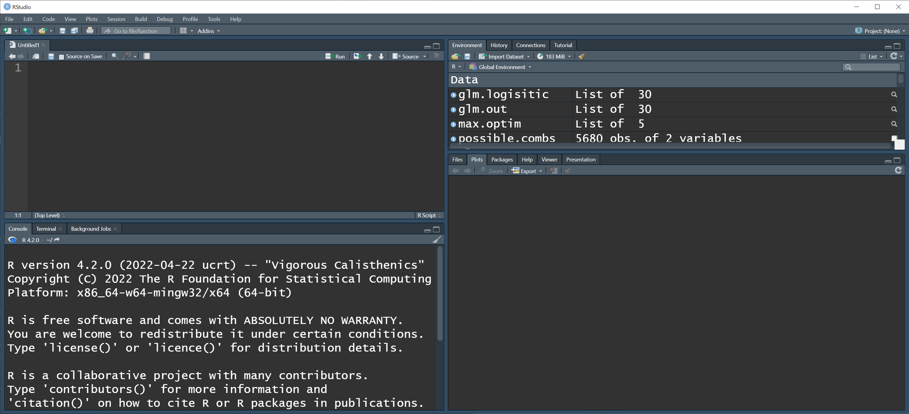
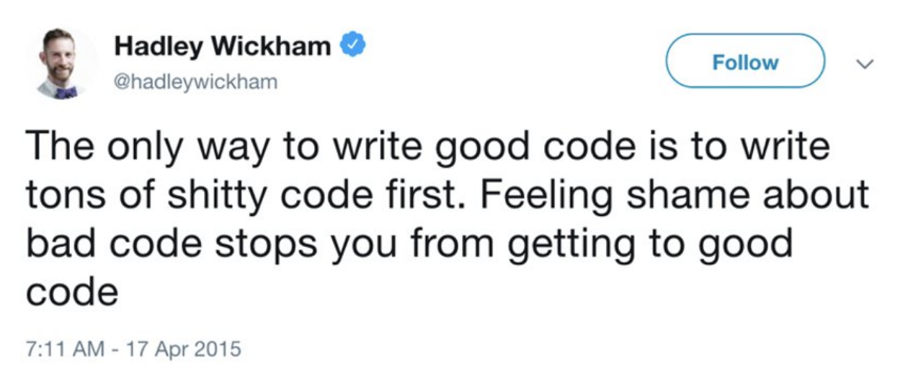

## Class Stuff
```{=html}
<style type="text/css">

code.r{
  font-size: 30px;
}
</style>
```

-   **Me:** Dr. Brian Gerber

-   **Class**: CI 117A, Monday 2pm-4:45pm

    -   Lecture/Lab/Discussion

-   **My Office**: CI 109

    -   No set office hours

    -   bgerber\@uri.edu

-   **Computers**: Always bring a laptop to class

    -   Software/R Packages should be installed prior to lab (posted on main website)

## What is this course?

```{=html}
<br><span style="color:#FF0000";><center><b>Quantitative Techniques in Natural Resources Science</center></b></span><br>
```
. . .

-   A work in progress

```{=html}
<br><center><span style="color:#FF0000";>¯\\\_(ツ)\_/¯ </center>
```
. . .

-   Adaptive!

-   Scope/depth depends on current baseline knowledge

-   mixture of <span style="color:blue"> stats/modeling/code/math/science philosophy/ecology</span>

## Our Goals 

::: incremental 

-   Better understand statistical modeling

-   Learn to test assumptions in design and modeling

-   Principles of statistical inference

-   Quantitative literacy / Statistical Notation

-   Science philosophy

-   Coding reproducibility and share-ability

-   Knowledge to carry across projects

    -   not highly specialized statistical models

:::

## Why is this class useful? {.scrollable}

-   Able to read modern ecological literature

. . .

-   Understand what you are doing when using data and models; **coding/statistics/modeling are related but not the same**

. . .

-   Coding skills

. . .

-   Taking control of evaluating assumptions

. . .

-   Collaborative with statisticians

. . .

-   Approach data and data analysis with an appropriate mindset and set of tools

## Who am I?

::: r-stack
{.fragment .absolute top="75" left="200" width="700" height="850"}

{.fragment .absolute top="75" left="75" width="1000" height="850"}
:::

## And you...

<span style="color:#078BCD">

<ul>

<li>What is your name?</li>

<li>What is your program/project/field of study?</li>

<li>Why do you want to learn more about 'quantitative techniques'?</li>

<li>What is your first emotion when you hear **statistics**, **math**, or **coding**?</li>

</ul>

</span>

## [Science Philosophy ]{style="color:#078BCD"}

*I am a pragmatist that believes theoretical foundations and logical justification are critical to science and scientific learning for decision making*.

## [Teaching Philosophy ]{style="color:#078BCD"}

::: incremental
-   I can not make you learn; learning is a choice (in every movement)

-   An inclusive environment is paramount for learning

-   Communication is key

-   Everyone has something to teach and something to learn

-   Struggle is good. Solving problems leads to learning

-   BUT....
:::

## Tentative Schedule {.smaller}

<a href="https://bgerber123.github.io/Schedule/Schedule.html">https://bgerber123.github.io/Schedule/Schedule.html</a>

## Grades

-   Attendance and Participation (10%)

    -   let me know prior to class if you can not make it

-   Weekly Assignments (60%)

    -   Due the following class

-   Project (30%)

## Project

::: columns
::: {.column width="70%"}
Groups (2-3) will design a

```{=html}
<span style="color:#FF0000";>
reading/discussion - lecture - lab - HW
</span>
```
around a statistical / methodology topic relevant to ecology and resource mgmt.

-   work with me
-   the topic needs to be general(ish)
-   lead one class period
:::

::: {.column width="30%"}
{fig-align="center" width="300"}
:::
:::

## R Code Language

. . .

Write down, what is the name of the 

-   object?
-   function?
-   argument(s)?

```{r,eval=TRUE,echo=TRUE}

a = seq(0,1,by=0.1)

```

. . . 

Note: code can be copied to your clipboard (top-right). 

<br>

Code scripts will also be on the website.

## RStudio

What does each panel do?

{width="95%" fig-align="center"}

. . .

Importance of your computer's CPU and memory?

## Getting help with Code {.scrollable}

::: incremental
-   Share via RStudio Server (ideally)

-   If emailing, include a script file and RData file (workspace)

-   Hierarchical code organization

    -   code structure using indenting
    -   top --\> bottom execution
    -   remove all extraneous code (minimal working example)
    -   the code you send is likely different than what you are working on
:::

. . .

**Help! My for loop doesn't work**...

```{r, echo = TRUE}
#| echo: TRUE
#| eval: FALSE
                cor.sp.route.cor=vector("list",n.species)
cor.sp=rep(NA,n.species)
            for(s in 1:n.species){
route=new.cov.species.long.scaled[[s]]$routeID
cor.sp[s]=cor(patch.size20.species.scaled.mat.center.route[s,],patch.count20.species.scaled.mat.center.route[s,])
    for(i in 1:nroutes){
temp1=patch.size20.species.scaled.mat.center.route[s,which(route==route.id[i])]
  temp2=patch.count20.species.scaled.mat.center.route[,][s,which(route==route.id[i])]
  if(length(temp1)>5){
  cor.sp.route.cor[[s]]=abs(c(cor.sp.route.cor[[s]],cor(temp1,temp2)))
  }}}

```

. . .

**Minimal/Annotated working example**

. . .

```{r, echo = TRUE}
#| echo: TRUE
#| eval: FALSE

#Load data (file provided)
cov.core.20k=load("./New Data Setup/habitat_radius_20k_core.RData")

#Create a list
cor.sp.route.cor=vector("list",12)

#Double loop with if statement
for(s in 1:cor.sp.route.cor){
  cor.sp[s]=cor(cor.sp.route.cor[s,],cor.sp.route.cor[s,])
    for(i in 1:length(cor.sp.route.cor)){
        if(length(cor.sp.route.cor[i,])>5){
          blah blah blah
        } #End if statement
    } #End i loop
} #End s loop

#ISSUE: The error occurs when s = 10. The error is "      ". 


```

## Code

{width="50%"}

## 

{fig-align="center" width="300"}
