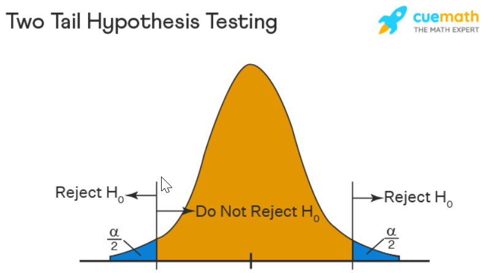
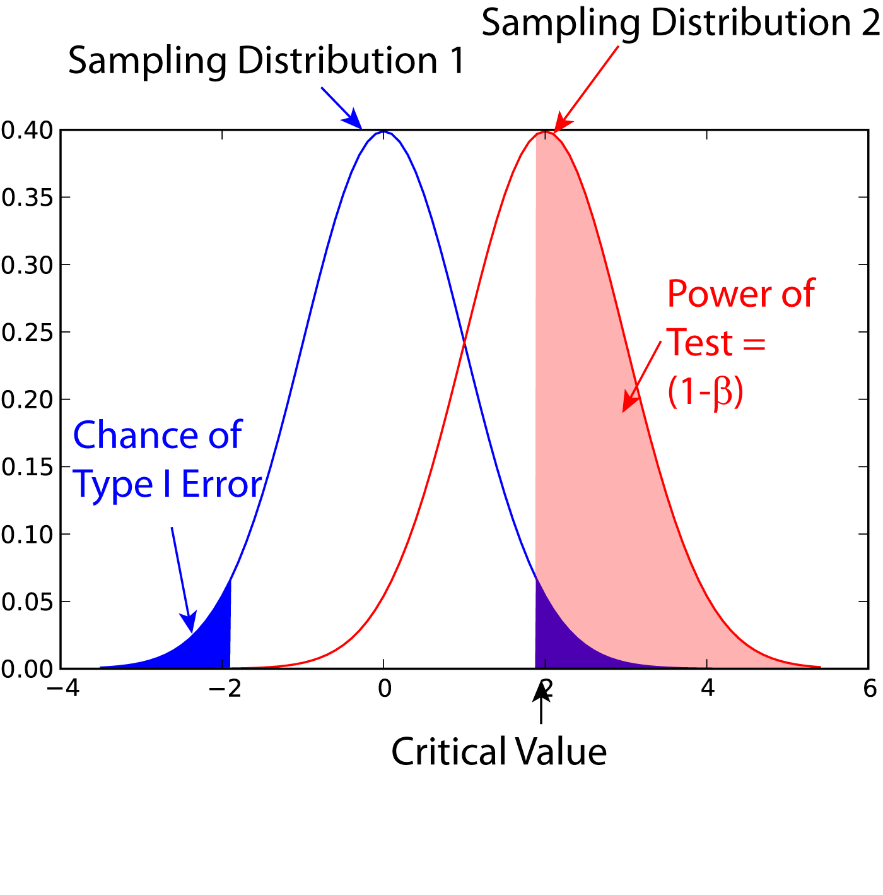
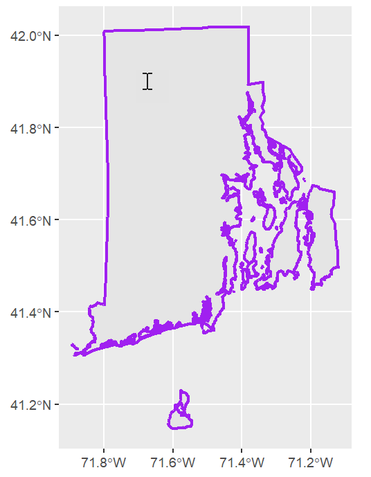
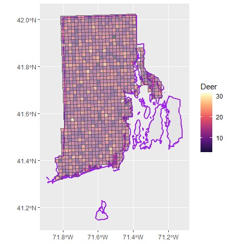
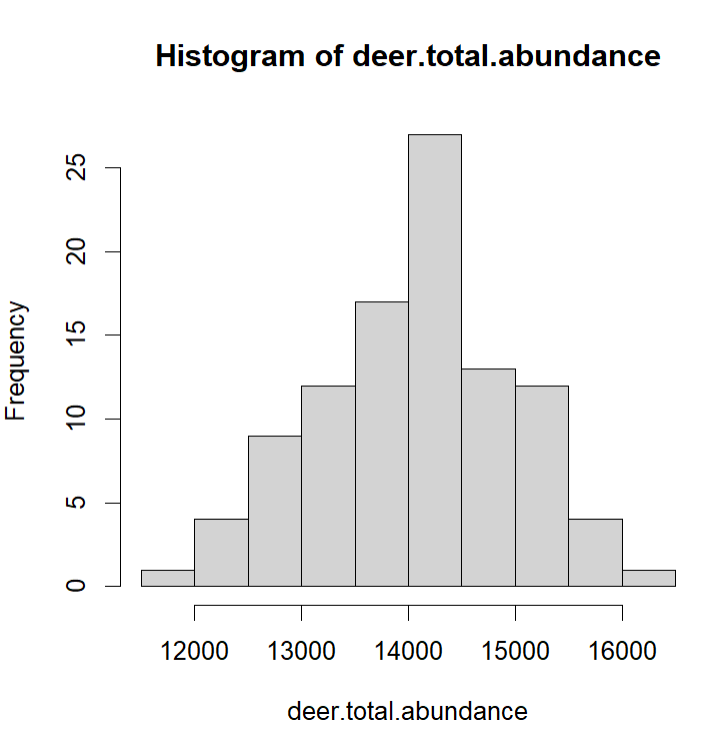

## Null Hypothesis Testing Paradigm

Often focused on Type I error ($\alpha$), rejecting the null hypothesis when it is actually true.

. . .

The Null hypothesis is commonly, $H_0(\mu_1 = \mu_2)$

. . .

{fig-align="center"}

## Criticsism of NHT?

## Statistical Power

```{=html}
<style type="text/css">

body, td {
   font-size: 14px;
}
code.r{
  font-size: 30px;
}
pre {
  font-size: 20px
}

</style>
```
What is statistical power?

::: incremental
-   Null Hypothesis Testing (NHT) paradigm

-   **Definition**: the probability that a test will reject a false null hypothesis.

    -   $H_0(\mu_1 = \mu_2)$ vs $H_1(\mu_1 \ne \mu_2)$

-   The higher the statistical power for a given experiment, the lower the probability of making a Type II error (false negative)
:::

## Power Analysis

<br>

Type I Error = P(reject $H_0$ \| $H_0$ is true) = $\alpha$

<br>

Power = P(reject $H_0$ \| $H_1$ is true)

. . .

Power = 1 - Type II Error

. . .

Power = 1 - Pr(False Negative)

. . .

Power = 1 - $\beta$


<!-- {.absolute top=260 left=350 width="500"} -->

## Type II Error / Power

{}

## Power Analysis

Contributions to statistical power

::: incremental

-   Which statistical test and its assumptions

-   Effective Sample size (simplest case this is $n$ per group)

-   Reality
    - t-test: difference of means 
    - How different these are: $\mu_{1}$ and $\mu_{2}$
    - How variable these are: $\sigma_{1}$ and $\sigma_{2}$
    
:::


## Power Analysis (Case Study)

**Objective**: To evaluate the relative use of two types of hummingbird feeders.


{fig-align="center"}

## Power Analysis (Case Study)

<br>

**Null Hypothesis** <br>
Mean daily use of each feeder is equal ($\mu_{1} = \mu_{2}$).

<br>

. . .

**Alt. Hypothesis** <br>
Mean daily use of each feeder is not equal ($\mu_{1} \neq \mu_{2}$).

<br>


. . .

**Statistical Test**: two-tailed t-test

## Power Analysis (Case Study)

First, we need to define TRUTH
```{r,echo = TRUE}
  Group1.Mean <- 100
  Group1.SD <- 20
  
  Group2.Mean <- 120
  Group2.SD <- 20
```

. . .

```{r,echo = FALSE, eval=TRUE,fig.align='center',fig.height=4}

  par(cex.lab=1.5,cex.axis=1.5)
  curve(dnorm(x,Group1.Mean,Group1.SD ),xlim=c(0,200),lwd=5,ylab="Density",xlab="Hummingbird visits per day")
  curve(dnorm(x,Group2.Mean,Group2.SD ),xlim=c(0,200),lwd=5,add=TRUE,col=2)
  legend("topleft",legend=c("Feeder 1","Feeder 2"),col=c("black","red"),lwd=3,cex=1.5)

```

## Power Analysis (R Code)

```{r,echo = TRUE}
#| echo: TRUE
#| eval: TRUE
#| code-line-numbers: 1|2,3|5,6|8,9|11,12,13

library(pwr)
# Wish to test a difference b/w groups 1 and 2
# Want to know if there is a difference in means
 
#Difference in Means
  effect.size <- Group1.Mean-Group2.Mean

#Group st. dev
  group.sd <- sqrt(mean(c(Group1.SD^2,Group2.SD^2)))

#Mean difference divided by group stdev
#How does the numerator and denominator influence this number?  
  d <- effect.size/group.sd


```


## Power Analysis

```{r,echo=TRUE}
#| echo: TRUE
#| eval: TRUE
#| code-line-numbers: 1|3,4|6,7

power = 0.8

out = pwr.t.test(d=d,power=power,type="two.sample",
                 alternative="two.sided")

#Sample Size Needed for each Group
out$n
```

. . .

<span style="color:red">Assuming Independence b/w feeders</span><br>
How do we design for this?


## Tradeoff (Power vs N) {.scrollable}

Let's consider multiple levels of power

. . .

```{r,echo=TRUE}
#| echo: TRUE
#| eval: TRUE
#| code-line-numbers: 1|3,4,5,6,7,8|10

power = matrix(seq(0.8,0.99,by=0.01))

my.func = function(x){                    
                      pwr.t.test(d=d,power=x,
                                 type="two.sample",
                                 alternative="two.sided"
                                )$n
}

out= apply(power,1, FUN=my.func)

```

. . .

```{r,echo=FALSE,fig.align='center', fig.height=3.5}
#Sample Sizes Needed for each Group for different power levels
#Change to total sample size
#out=out*2
par(cex.lab=1.5,cex.axis=1.5,mar=c(5,5,1,1))
plot(power,out,type="b",ylab="Sample Size Per Group",
     xlab="Power",lwd=5)
abline(h=c(20,25,30,35),col="grey")
```

## Robust to Assumptions about Truth? {.scrollable}

<span style="color:red">These results assume we are correct about... <span>
```{r,echo=TRUE}
  Group1.Mean <- 100
  Group1.SD <- 20
  
  Group2.Mean <- 120
  Group2.SD <- 20
```

. . . 

<br>

What if we are wrong? 

<br>

How do we evaluate this?


## Tradeoffs (Power, Effect Size, N) {.scrollable}

```{r,echo=TRUE}
#| echo: TRUE
#| eval: TRUE

# Allow group 1 to vary
  Group1.Mean <- seq(10,110,by=5)

#THIS IS THE SAME
  Group1.SD <- 20
  Group2.Mean <- 120
  Group2.SD <- 20
  group.sd <- sqrt(mean(Group1.SD^2,Group2.SD^2))

# Variable effect.size  
  effect.size <- Group1.Mean-Group2.Mean
  d <- effect.size/group.sd

#setup combinations of d and power
  power = seq(0.8,0.99,by=0.01)
  power.d = expand.grid(power,d)
  power.d$Var1 = as.numeric(power.d$Var1)
  
```  

<br>


. . .

```{r,echo=TRUE}
#| echo: TRUE
#| eval: TRUE
  
#make new function and use mapply
my.func = function(x,x2){                    
                      pwr.t.test(d=x2,power=x,
                                 type="two.sample",
                                 alternative="two.sided"
                                )$n
}

# mapply function
  out= mapply(power.d$Var1,power.d$Var2, FUN=my.func)

# unstandardized the effect size back to difference of means
  power.d$Var2=power.d$Var2*group.sd
  
  out2=cbind(power.d,out)
  colnames(out2)=c("power","d","n")

```


## Tradeoffs (Power, Effect Size, N) 

```{r,echo=FALSE, fig.height=6, fig.width=10}
library(plotly)
fig <- plot_ly(out2, x = ~power, y = ~d, z = ~n, marker = list(size = 5))
fig <- fig %>% add_markers(color=~n)
fig <- fig %>% layout(scene = list(xaxis = list(title = 'Power'),
                     yaxis = list(title = 'd'),
                     zaxis = list(title = 'Sample Size')))
#fig <- fig %>%  layout( xaxis = list(nticks=10, tickmode = "auto"))
fig


```

## Study Design

Let's add some more *reality* in our work.

. . .

<br>

**Objective**: Evaluate sample size trade-offs for estimating white-tailed deer abundance throughout Rhode Island.

. . .

**Methodology**: Count deer in 1 sq. mile cells using FLIR technology attached to a fixed wing plane.

{fig-align="center" width="483"}

## Study Design 

<span style="color:blue">Steps to consider</span>

:::: {.columns}

::: {.column width="40%"}

-   **Sampling Frame**

    -   all of RI or some subset

:::

::: {.column width="60%"}

{fig-align="center"}
:::

::::

## Study Design 

<span style="color:blue">Steps to consider</span>

:::: {.columns}

::: {.column width="40%"}

-   **The "Truth"**

    -   how many deer per cell; how variable

:::

::: {.column width="60%"}

{fig-align="center"}
:::

::::

## Study Design 

<span style="color:blue">Steps to consider</span>

:::: {.columns}

::: {.column width="40%"}

-   **Sampling Process**

    -   how to pick each cell

:::

::: {.column width="60%"}

{fig-align="center"}
:::

::::

## Study Design 

<span style="color:blue">Steps to consider</span>

:::: {.columns}

::: {.column width="50%"}

-   **Estimation Process**

    -   estimate total deer population from the sample

-   **Criteria to Evaluate**

    -   sampling distribution, confidence interval bounds, precision of estimate, etc.

:::

::: {.column width="50%"}

{fig-align="center"}
:::

::::


<!-- ## Study Design {.scrollable} -->

<!-- **Steps to consider**: -->

<!-- ::: incremental  -->
<!-- -   **Sampling Frame** -->

<!--     -   all of RI or some subset -->

<!-- -   **The "Truth"** -->

<!--     -   how many deer per cell; how variable -->

<!-- -   **Sampling Process** -->

<!--     -   how to pick each cell -->

<!-- -   **Estimation Process** -->

<!--     -   estimate total deer population from the sample -->

<!-- -   **Criteria to Evaluate** -->

<!--     -   sampling distribution of estimate, confidence interval bounds, precision of estimate, etc. -->
<!-- ::: -->

## Go to code
