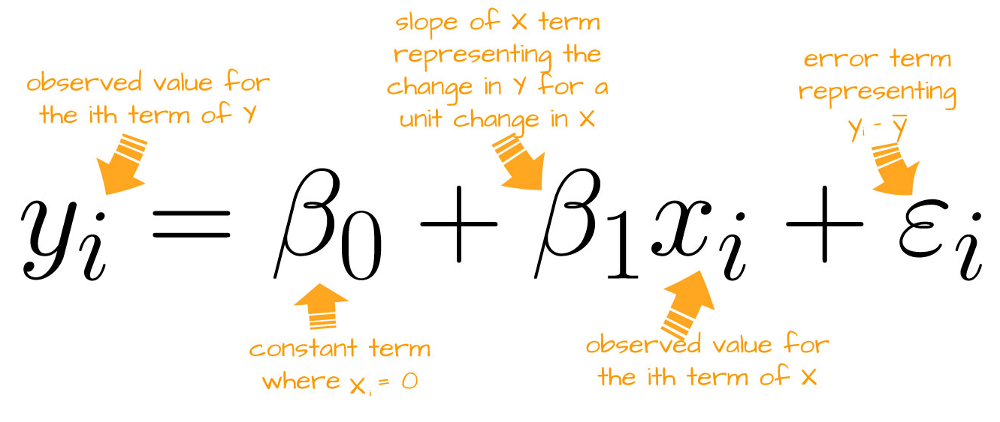
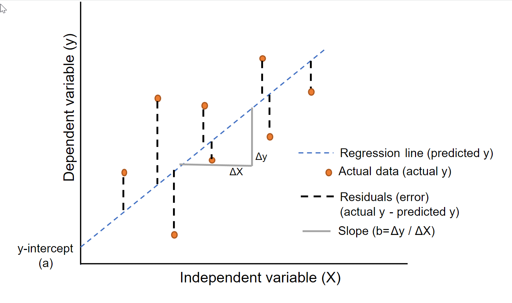

## Why model data?
```{=html}
<style type="text/css">

body, td {
   font-size: 14px;
}
code.r{
  font-size: 30px;
}
pre {
  font-size: 12px
}
</style>
```

. . .

In ecology, we use models to,

-   describe relationships among outcomes and processes
-   predict future outcomes, such as responses to management

. . .

Historically, ecologists focused mainly on <span style="color:red">hypothesis testing.</span>

. . .

<br>

<span style="color:blue">
"We found no correlation b/w bird richness and canopy cover (p > 0.05)"
</span>[naked p-value]

## GLM
Generalized linear model framework

. . .

$$
\begin{align*}
\textbf{y}\sim& [\textbf{y}|\boldsymbol{\mu},\sigma] \\
g(\boldsymbol{\mu}) =& \textbf{X}\boldsymbol{\beta}
\end{align*}
$$
{fig-align="center" width="275"}


## Linear Regression Index Notation 
{fig-align="center" width="275"}

## Linear Regression Figure
$$
y_{i} = \beta_0+\beta_1 x_i + \epsilon_i \\ \epsilon_i \sim \text{Normal}(0,\sigma)
$$

{fig-align="center" width="275"}


## Linear Regression Index Notation (<span style="color:blue">better</span>) {.scrollable}

$$
\begin{align*}
y_{i} \sim& \text{Normal}(\mu_{i},\sigma) \\
\mu_{i} =& \beta_{0} + \beta_{1}x_{i}
\end{align*}
$$
. . .

$$\mu_{i} = 0 + 0.5 \times x_{i}$$

. . .

```{r, eval=TRUE, echo=TRUE}
# x variable (independent and known)
  x = seq(0,2,by=0.1)
  x
```  

. . .

```{r, eval=TRUE, echo=TRUE}
# marginal coefficients (estimated if unknown)
  beta0 = 0
  beta1 = 0.5

#stdev of y, (estimated if unknown) 
  sigma = 0.5

# Derive mu  
  mu = beta0 + beta1*x

# Single random realization of y, 
#  based on mu and sigma  
  set.seed(43252)
  y =  rnorm(length(mu),mean = mu, sd = sigma)

#plot x and y  
  par(cex.axis=1.3,cex.lab=1.3)
  plot(x,y,type="p",col=4,lwd=4,ylim=c(-2,3),
       pch=18,cex=2)
  lines(x,mu,lwd=3)
```

. . .

#### Plot many replicates of y

```{r, eval=TRUE, echo=TRUE}
#sample many times  
  y.many = replicate(1000,rnorm(length(mu),mu, sigma))

#plot all samples with true mu
  par(cex.axis=1.3,cex.lab=1.3)
  matplot(y.many,type="p",pch=18,xaxt="n",col=2,cex=2,xlab="x",ylab="y")
  axis(1,at=1:length(x),lab=x)
  lines(1:length(x),mu,lwd=3)
  points(1:length(x),y,type="p",col=4,lwd=4,ylim=c(-2,3),
       pch=18,cex=2)
```


## Vector Notation 
Column vectors

-   $\textbf{y} \equiv (y_1, y_2, . . ., y_n)'$
<br>

. . .

```{r, eval=TRUE, echo=TRUE}
y <- matrix(c(1,2,3),nrow=3,ncol=1)
y
```

## Vector Notation 

-   $\textbf{x} \equiv (x_1, x_2, . . ., x_n)'$ 

```{r, eval=TRUE, echo=TRUE}
x <- matrix(c(0.5,1,-2),nrow=3,ncol=1)
x
```

## Vector Notation 

-   $\boldsymbol{\beta} \equiv (\beta_1,\beta_2,...,\beta_p)'$ 

```{r, eval=TRUE, echo=TRUE}
p=3
beta <- matrix(c(0,-2,2),nrow=p,ncol=1)
beta
```


## Vector Notation 

-   $\mathbf{1} \equiv (1,1,...,1)'$ 


## Matrix Notation

-   $\textbf{X}\equiv (\textbf{x}_1,\textbf{x}_2,...,\textbf{x}_p)$

. . .

```{r, eval=TRUE, echo=TRUE}
p=2
X <- matrix(c(1,2,3,4,5,6),nrow=3,ncol=p,byrow=FALSE)
X
```

## Linear Algebra 

-   $\textbf{y}'\textbf{y}$

. . .

$$
=\begin{bmatrix}
1 & 2 & 3
\end{bmatrix}
\begin{bmatrix}
1 \\
2 \\
3 \\
\end{bmatrix}
$$

. . .

$$
=\begin{bmatrix}
(1\times1) + (2\times2) + (3\times3)\\
\end{bmatrix} \\= [14]
$$

. . .

```{r, eval=TRUE, echo=TRUE}
t(y)%*%y
```

## Linear Algebra

When can we do matrix multiplication?

```{r, eval=TRUE, echo=TRUE}
first=t(y)
dim(first)

second=y
dim(second)

#When this is true
  ncol(first)==nrow(second)
```


```{=html}
<span><center>(1 x 3) (3 x 1)</center></span>
```


## Linear Algebra {.scrollable}

$g(\boldsymbol{\mu}) = \textbf{X}\boldsymbol{\beta}$

. . .

-   $\textbf{X}\boldsymbol{\beta}$

. . .

$$
\textbf{X}=
\begin{bmatrix}
1 & x_{1,1} & x_{1,2} \\
1 & x_{2,1} & x_{2,2} \\
1 & x_{3,1} & x_{3,2}
\end{bmatrix}
\boldsymbol{\beta} =
\begin{bmatrix}
\beta_0  \\
\beta_1 \\ 
\beta_2   
\end{bmatrix}
$$

. . .

$$
\textbf{X}\boldsymbol{\beta} = 
\begin{bmatrix}
\beta_0\times 1 + \beta_1\times x_{1,2} + \beta_1\times x_{1,3} \\
\beta_0\times 1 + \beta_1\times x_{2,2} + \beta_1\times x_{2,3} \\
\beta_0\times 1 + \beta_1\times x_{3,2} + \beta_1\times x_{3,3} \\
\end{bmatrix}\\
$$

. . .

$$
 = 
\begin{bmatrix}
\beta_0 + \beta_1 x_{1,2} + \beta_1 x_{1,3} \\
\beta_0 + \beta_1 x_{2,2} + \beta_1 x_{2,3} \\
\beta_0 + \beta_1 x_{3,2} + \beta_1 x_{3,3} \\
\end{bmatrix}\\
$$

## Link functions

$g(\boldsymbol{\mu}) = \textbf{X}\boldsymbol{\beta}$

- $g(\boldsymbol{\mu})$

. . .

Link functions map parameters from one <span style="color:red">support</span> to another.

. . .

<br>

<span style="color:blue">Why is that important for us?</span>

<br>

. . .

To put a linear model on parameters of interest and ensure the parameter support is maintained.

## Link functions {.scrollable}

### Identity 
$g(\boldsymbol{\mu}) = \mathbf{1}'\boldsymbol{\mu}$

. . .

#### Linear Regression

$$
\begin{align*}
\textbf{y}\sim& [\textbf{y}|\boldsymbol{\mu},\sigma]\\
[\textbf{y}|\boldsymbol{\mu},\sigma]=& \text{Normal}(\boldsymbol{\mu},\sigma)\\
\boldsymbol{\mu} =& g(\boldsymbol{\mu}) = \mathbf{1}'\boldsymbol{\mu} = \textbf{X}\boldsymbol{\beta}
\end{align*}
$$
. . .

No transformation is needed because the parameter support is maintained.
$$
\begin{align*}
\mu \in& (-\infty,\infty)\\
\textbf{X}\boldsymbol{\beta} \in& (-\infty,\infty)
\end{align*}
$$

## Linear Regression Simulation {.scrollable}

```{r, eval=TRUE,echo=TRUE}
#Design matrix
  set.seed(6454)
  Var1 = rnorm(20)
  X = model.matrix(~Var1)
  head(X)
  
```

. . .

```{r, eval=TRUE,echo=TRUE}
#Marginal Coefficients  
  beta=matrix(c(0,5))

#linear terms
  lt = X%*%beta

#mu
  mu=lt
  
#sample
  set.seed(5435)
  y = rnorm(length(mu),mu)
  y
```

## Linear Regression Estimation {.scrollable}
```{r, eval=TRUE, echo=TRUE}
# Fit model to sample
  model1=glm(y~X+0,family = gaussian(link = "identity"))
  summary(model1)
```

```{r,echo = FALSE}
library(equatiomatic)
extract_eq(model1)
```
## Linear Regression Evaluation {.scrollable}

```{r, eval=TRUE, echo=TRUE}
 #sample many times  
  y.many = replicate(1000,rnorm(length(mu),mu, sigma))
  dim(y.many)
  
 #Estimate coefs for all 100 samples
  coef.est=apply(y.many,2,FUN=function(y){
              model1=glm(y~X+0,family = gaussian(link = "identity"))
              model1$coefficients
  })

  dim(coef.est)
```

<br>

. . .

```{r, eval=TRUE, echo=TRUE}  
  plot(density(coef.est[1,],adjust=2),type="l",lwd=2,
       main=bquote("Sampling Distribution"~beta[0]),
       xlab=bquote(beta[0]))
      abline(v=beta[1],col=2,lwd=4)
  plot(density(coef.est[2,],adjust=2),type="l",lwd=2,
       main=bquote("Sampling Distribution"~beta[1]),
       xlab=bquote(beta[0]))
  abline(v=beta[2],col=2,lwd=4)
```


## logit link {.scrollable}


$$
\begin{align*}
\textbf{y}\sim& [\textbf{y}|N,\boldsymbol{p}]\\
\end{align*}
$$

. . .

$$
\begin{align*}
[\textbf{y}|N,\boldsymbol{p}] =& \text{Binomial}(N,\boldsymbol{p})
\end{align*}
$$
. . .

$$
\begin{align*}
g(\boldsymbol{p}) =& \text{logit}(\boldsymbol{p}) = \text{log}(\frac{\boldsymbol{p}}{1-\boldsymbol{p}})
\end{align*}
$$
. . .

### inverse-logit (expit)

$$
\boldsymbol{p} = g^{-1}(\boldsymbol{\textbf{X}\boldsymbol{\beta}}) = \text{logit}^{-1}(\textbf{X}\boldsymbol{\beta}) = \frac{e^{\textbf{X}\boldsymbol{\beta}}}{e^{\textbf{X}\boldsymbol{\beta}}+1}
$$

. . .

<br>

Full model more simply as, 

$$
\begin{align*}
\textbf{y} \sim& \text{Binomial}(N,\boldsymbol{p})\\
\text{logit}(\boldsymbol{p}) =& \textbf{X}\boldsymbol{\beta}
\end{align*}
$$
. . .

<span style="color:blue">Remember,</span>
<br>
$\boldsymbol{p} \in [0,1]$

$\textbf{X}\boldsymbol{\beta} \in (-\infty,\infty)$

## logit/p mapping {.scrollable}

```{r, eval=TRUE,echo=TRUE, fig.align='center'}
p=seq(0.01,0.99,by=0.01)
logit.p=qlogis(p)
par(cex.lab=1.5,cex.axis=1.5)
plot(p,logit.p,type="l",lwd=4,col=3,xlab='p',ylab="logit(p)")
```

## Logistic Regression Simulation {.scrollable}

. . .

```{r, eval=TRUE,echo=TRUE, fig.align='center'}
#Design matrix
  set.seed(43534)
  Var1 = rnorm(20)
  X = model.matrix(~Var1)
  head(X)
```  

. . .

```{r, eval=TRUE,echo=TRUE, fig.align='center'}
# marginal coefficients (on logit-scale)
  beta=c(-4,8)

#linear terms
  lt = X%*%beta

#probability
  p=plogis(lt)
  head(round(p,digits=2))

#sample
  set.seed(14353)
  y = rbinom(n=length(p),size=1,p)
  y
```

. . .

```{r, eval=TRUE,echo=TRUE, fig.align='center'}
#Plot the linear 'terms'  and probability
  par(cex.lab=1.2,cex.axis=1.2)
  plot(Var1,lt,type="b",lwd=3,col=2,
       xlab="x",ylab="Linear Terms (logit-value)")  

  index=order(Var1)
  plot(Var1[index],p[index],type="b",lwd=3,col=2,xlab="x",ylab="Probability")  
```

## Logistic Regression Estimation {.scrollable}
```{r, eval=TRUE, echo=TRUE}
# Fit model to sample 
  model1=glm(y~X+0, family = binomial(link = "logit"))
  summary(model1)
```

## Lostici Regression Evaluation {.scrollable}

```{r, eval=TRUE, echo=TRUE}
 #sample many times  
  y.many = replicate(1000,rbinom(n=length(p),size=1,p))
  dim(y.many)
  
 #Estimate coefs for all 100 samples
  coef.est=apply(y.many,2,FUN=function(y){
          model1=glm(y~X+0, family = binomial(link = "logit"))
          
  model1$coefficients
  })

  dim(coef.est)
```

<br>

. . .

```{r, eval=TRUE, echo=TRUE}  
  plot(density(coef.est[1,],adjust=2),type="l",lwd=2,
       main=bquote("Sampling Distribution"~beta[0]),
       xlab=bquote(beta[0]))
      abline(v=beta[1],col=2,lwd=4)
  plot(density(coef.est[2,],adjust=2),type="l",lwd=2,
       main=bquote("Sampling Distribution"~beta[1]),
       xlab=bquote(beta[0]))
  abline(v=beta[2],col=2,lwd=4)
```


## A Model by another name {.scrollable}

<style>
td {
  font-size: 23px
}
</style>

| Model Name|$[y|\boldsymbol{\theta}]$| Link|
|-----------|-------------------------|-----|
| ANOVA ($x_{1}$ is categorical/multiple levels) | Normal        | identity | 
| ANCOVA ($x_{1}$ is categorical, $x_{2}$ is continuous))              | Normal        | identity |
| t-test ($x_{1}$ is categorical with 2 levels)      | Normal        | identity |
| Linear Regression $x_{1}$ is continuous   | Normal        | identity |
| Multiple Linear Regression $x_{p}$ is continuous   | Normal        | identity |
| Logistic Regression  | Binomial      | logit    |
| Probit Regression    | Binomial      | probit   |
| Log-linear Regression| Poisson       | log      |
| Poisson Regression   | Poisson       | log      |
| Survival Analysis    | Exponential   | log      | 
| Linear Regression    | Normal        | Identity |
| Inverse Polynomials  | Gamma         | Reciprocal|

: {tbl-colwidths="\[60,10,10\]"}

[Nelder and Wedderburn (1972)](https://www.jstor.org/stable/2344614)


