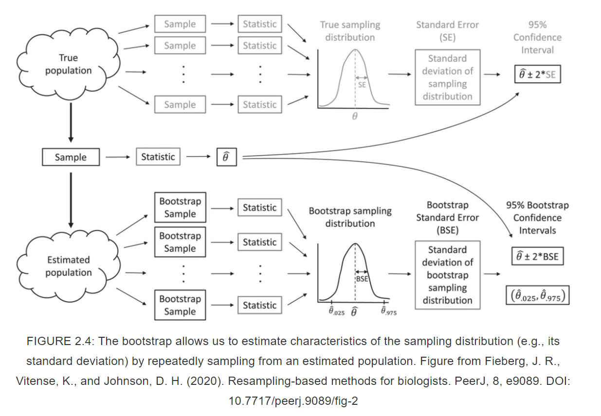
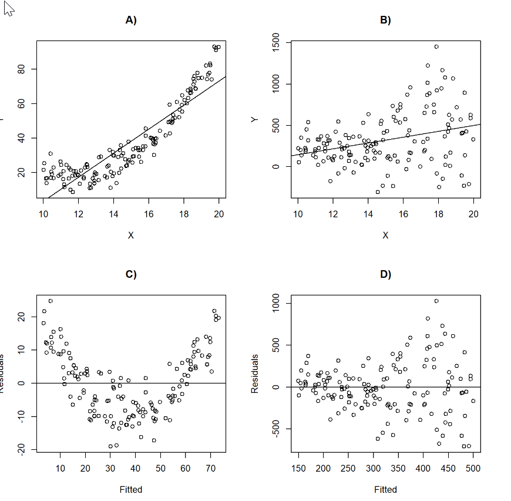

## Objectives
-   linear regression fundamentals
-   glm function
-   categorical and continuous variables
-   additive and interaction models
-   regression assumptions
-   predicting
-   confidence intervals
-   bootstrapping for confidence intervals


## Linear Regression (motivation)
```{r, echo=FALSE,eval=TRUE}
n=1000
b0=10
b1=2
x=rnorm(n,40,10)
mu=b0+b1*x
y=rnorm(n,mu,sd=30)

plot(x,y)
```

## Linear Regression (Equation)

{fig-align="center" width="400"}

## Linear Regression (Equation 2) 

<br>

$$
y_{i} \sim \text{Normal}(\mu_{i}, \sigma)\\
\mu_{i} = \beta_0 + \beta_1 \times x_i
$$

## Linear Regression Line 1 {.scrollable}

```{r,echo=FALSE,eval=TRUE, fig.align='center',width="1000"}
plot(x,y,cex.lab=1.3,cex.axis=1.3, main="Intercept (beta0) = 9.06 \n Slope of x (beta1) = 2.0")
lm.out=lm(y~x)
abline(lm.out,lwd=3,col=3)

legend("topleft",col=c("green"),lty=2,legend=c("Mean"),lwd=4)

```

## Linear Regression Line 2 {.scrollable}

```{r,echo=FALSE,eval=TRUE, fig.align='center',width="1000"}
plot(x,y,cex.lab=1.3,cex.axis=1.3, main="Intercept (beta0) = 9.06 \n Slope of x (beta1) = 2.0")
lm.out=lm(y~x)
abline(lm.out,lwd=3,col=3)

newx = seq(min(x),max(x),by = 0.05)
conf_interval <- predict(lm.out, newdata=data.frame(x=newx), interval="confidence", level = 0.95)

matlines(newx, conf_interval[,2:3], col = "blue", lty=2,lwd=4)

legend("topleft",col=c("green","blue"),lty=2,legend=c("Mean","Confidence Interaval (mean)"),lwd=4)

```

## Linear Regression Line 3 {.scrollable}

```{r,echo=FALSE,eval=TRUE, fig.align='center',width="1000"}
plot(x,y,cex.lab=1.3,cex.axis=1.3, main="Intercept (beta0) = 9.06 \n Slope of x (beta1) = 2.0")
lm.out=lm(y~x)
abline(lm.out,lwd=3,col=3)

newx = seq(min(x),max(x),by = 0.05)
conf_interval <- predict(lm.out, newdata=data.frame(x=newx), interval="confidence", level = 0.95)

pred_interval <- predict(lm.out, newdata=data.frame(x=newx), interval="prediction", level = 0.95)


matlines(newx, conf_interval[,2:3], col = "blue", lty=2,lwd=4)

matlines(newx, pred_interval[,2:3], col = "purple", lty=2,lwd=4)

legend("topleft",col=c("green","blue","purple"),lty=2,legend=c("Mean","Confidence Interaval (mean)", "Prediction Interval (data)"),lwd=4)

```


## Visual

{fig-align="center" width="450"}

## Assumptions
#### Independence of the errors


<br>

Correlation($\epsilon_{i}$,$\epsilon_{j}$) = 0, for all pairs of $i$ and $j$

<br>

This means that knowing how far observation  $i$ will be from the true regression line tells us nothing about how far observation  $j$  will be from the regression line.

## Assumptions
#### Homogeniety of the variance

<br>

var($\epsilon_{i}$) = $\sigma^2$

<br>

Constancy in the scatter of observations above and below the line

## Assumptions

#### Linearity

<br>
$$
E[y_i|x_i] = \mu_i = \beta_0 + \beta_1*x_i \\
$$
<br>

The hypothesis about the variables included in the model tell us about the mean. 

## Assumptions
#### Normality

<br>
$$
\epsilon_i \sim \text{Normal}(0,\sigma)
$$
<br>

Each $i^{th}$ residual comes from a Normal distribution with a  mean of zero, is symmetricly disributed around zero, and varies around zero by the standard deviation. 

## Assumption Violations

<br>

### Robustness

<br>

Linearity and constant variance are often more important than the assumption of normality (see e.g., [Knief & Forstmeier, 2021](https://link.springer.com/article/10.3758/s13428-021-01587-5) and references therein)

<br>

<p style="text-align:center">
<b>This especially true for large sample sizes</b>
</p>

## Intercept-Only Model

$$
y_{i} \sim \text{Normal}(\mu_{i}, \sigma^2)\\
\mu_{i} = \beta_0
$$

## Simulate Intercept-Only Model

```{r,eval=TRUE,echo=TRUE,fig.align='center'}
#Simulate Data for this model

#Setup parameters
  n=100 # sample size
  mu=10 # true mean
  sigma=2 # true std.dev

# Simulate a data set of observations
  set.seed(43243)
  y=rnorm(n,mean=mu, sd=sigma)
```  

## Visualize Intercept-Only Model

```{r,eval=TRUE,echo=TRUE,fig.align='center'}
  hist(y)
```  

## Fit Intercept-Only Model 

```{r,eval=TRUE,echo=TRUE}
# Fit model/hypothesis using maximum likelihood
  model1 = glm(y~1, family=gaussian(link = identity))

  model1.1 = glm(y~1)

# Compare Results  
  rbind(model1$coefficients,model1.1$coefficients)
```

## Fit Intercept-Only Model 

```{r,eval=TRUE,echo=TRUE}
    
# Summary of model results  
  summary(model1)
```

## Fitted-values Intercept-Only Model {.scrollable}

```{r,eval=TRUE,echo=TRUE}
#Predict response for all data
  preds=predict(model1, se.fit = TRUE)
  preds
```  

## Confidence Intervals Intercept-Only Model

```{r,eval=TRUE,echo=TRUE}
# Get 90% confidence intervals (Type I error = 0.1)
  (preds$fit+preds$se.fit*qnorm(0.05))[1]
  (preds$fit+preds$se.fit*qnorm(0.95))[1]


  CI.Normal=confint(model1, level=0.9)
  CI.Normal
  
```
## Bootstrapping 

See, [John Fieberg's book chapter](https://fw8051statistics4ecologists.netlify.app/boot.html)   

<br>

Instead of relying on the 95% intervals from an assumed normal distribution, we will create a distribution by 
resampling our data.

## Bootstrapping (idea)
{fig-align="center" width="450"}

## Bootstrapping (code)

```{r, echo=TRUE, include=TRUE, eval=TRUE}

# Setup
  nboot <- 1000 # number of bootstrap samples
  nobs <- length(y)
  bootcoefs <- rep(NA, nboot)
# Start loop  
for(i in 1:nboot){
  set.seed(43243+i)
  # Create bootstrap data set by sampling original observations w/ replacement  
  bootdat <- y[sample(1:nobs, nobs, replace=TRUE)] 
  # Calculate bootstrap statistic
  glmboot <- glm(bootdat ~ 1)
  bootcoefs[i] <- coef(glmboot)
}
```  
## Bootstrapping (code)
```{r}
par(mfrow = c(1, 1))
hist(bootcoefs, main = expression(paste("Bootstrap distribution of ", hat(beta)[0])), xlab = "")
```

## Bootstrapping (code)
```{r, echo=TRUE, include=TRUE, eval=TRUE}
# Calculate bootstrap standard errors
  boot.se=sd(bootcoefs)

# boostrap-normal CI
  boot.normal=c(
        (preds$fit+boot.se*qnorm(0.05))[1],
        (preds$fit+boot.se*qnorm(0.95))[1])

# bootstrap percentile
confdat.boot.pct <- quantile(bootcoefs, probs = c(0.05, 0.95))

```

## Comparison

```{r, eval=TRUE, echo=FALSE}
confdata <- data.frame(LCL=c(boot.normal[1],CI.Normal[1],confdat.boot.pct[1]),
           UCL=c(boot.normal[2],CI.Normal[2],confdat.boot.pct[2]),
           method=c("Normal Assumption", "Bootstrap-Normal", "Bootstrap-percentile")
          )
confdata$estimate <- rep(coef(model1),3)
library(ggplot2)
ggplot(confdata, aes(y = estimate, x = " ", col = method)) + 
  geom_point() +
  geom_pointrange(aes(ymin = LCL, ymax = UCL),  
                  position = position_dodge(width = 0.9))

```

## Categorical Variable w/ 2 levels {.scrollable}
$$
y_{i} \sim \text{Normal}(\mu_{i}, \sigma^2)\\
\mu_{i} = \beta_0+\beta_1\times x_i
$$
where $x_i$ is either a zero or one, indicating whether the $i^{th}$ row is from <span style="color:blue">site 1</span> (*0*) or <span style="color:blue">site 2</span> (*1*).


## Categorical Variable w/ 2 levels {.scrollable}

```{r, echo=TRUE, include=TRUE, eval=TRUE}
# Setup data
  x=as.factor(rep(c("Site 1","Site 2"),n/2))
  levels(x)
  
# Turn the factor into 0 and 1's
  head(model.matrix(~x))
  
  x.var=model.matrix(~x)[,2]
```

. . .

<br>

```{r, echo=TRUE, include=TRUE, eval=TRUE}
# Parameters  
  b0=50
  b1=-20
  mu=b0+b1*x.var

# Sample Data
  set.seed(43243)
  y=rnorm(n,mean=mu,sd=4)

```

. . .

```{r, echo=TRUE, include=TRUE, eval=TRUE}
#fit the model 
  model2=glm(y~x)
  model2.1=glm(y~x.var)

#comparison  
  rbind(coef(model2), coef(model2.1))
```

## Categorical Variable w/ 2 levels {.scrollable}
```{r, echo=TRUE, include=TRUE, eval=TRUE}
summary(model2)
```

## Relevel {.scrollable}

We can manipulate the factor levels of $x$ to indicate that <span style="color:blue">site 1</span> is denoted by a **1** now and <span style="color:blue">site 2</span> is denoted by a **0** now.

. . .

<br>

```{r, echo=TRUE, include=TRUE, eval=TRUE}
#change intercept meaning
  x.relev=relevel(x,ref="Site 2")
  levels(x.relev)
```

. . .

<br>

```{r, echo=TRUE, include=TRUE, eval=TRUE}
#fit the model again
  model2.2=glm(y~x.relev)

#Look at coefs  
  rbind(coef(model2),coef(model2.2))
```

. . .

<br>

```{r, echo=TRUE, include=TRUE, eval=TRUE}
#compare predictions  
  predict(model2)[1:2]  
  predict(model2.2)[1:2]  
```

## Categorical Variable w/ 4 levels (Dummy Coding)

$$
y_{i} \sim \text{Normal}(\mu_{i}, \sigma^2)\\
\mu_{i} = \beta_0+(\beta_1\times x_{1,i}) + (\beta_2\times x_{2,i}) + (\beta_3\times x_{3,i})
$$
$x_{1,i} =$ indicator of site 2 (1) or not (0)

$x_{2,i} =$ indicator of site 3 (1) or not (0)

$x_{3,i} =$ indicator of site 4 (1) or not (0)


## Categorical Variable w/ 4 levels (Dummy Coding) {.scrollable}

```{r, echo=TRUE, include=TRUE, eval=TRUE}
#Setup Data
  x=as.factor(rep(c("Site 1","Site 2","Site 3", "Site 4"),n/4))
  levels(x)

#Convert factors to 0 and 1's
  head(model.matrix(~x))

  x.var=model.matrix(~x)[,2:4]
```

<br>

. . .

```{r, echo=TRUE, include=TRUE, eval=TRUE}
# Set Parameters  
  b0=50 #Site 1
  b1=-20 #Diff of site 2 to site 1
  b2=-200 #Diff of site 3 to site 1
  b3=100 #Diff of site 4 to site 1
  
# Mean  
  mu=b0+b1*x.var[,1]+b2*x.var[,2]+b3*x.var[,3]

#True mean group-level values
  unique(mu)
  
#Grand Mean
  mean(unique(mu))
```

<br>

. . .

```{r, echo=TRUE, include=TRUE, eval=TRUE}
# Simulate Data  
  set.seed(43243)
  y=rnorm(n,mean=mu,sd=4)
```

<br>

. . .

```{r, echo=TRUE, include=TRUE, eval=TRUE}
#fit the model- see how we did
  model3=glm(y~x)
  model3.1=glm(y~x.var)

#Compare coefs    
  rbind(coef(model3),
  coef(model3.1))
```

## Effect Coding w/ 4 levels {.scrollable}

[Effect Coding Link](https://stats.stackexchange.com/questions/52132/how-to-do-regression-with-effect-coding-instead-of-dummy-coding-in-r)

```{r, echo=TRUE, include=TRUE, eval=TRUE}

#Use effect coding to make the intercept the grand mean
  model3.2=glm(y~x,contrasts = list(x = contr.sum))


# Intercept = grand mean of group-means
# Coef 1 = effect difference of Site 1 from Grand Mean
# Coef 2 = effect difference of Site 2 from Grand Mean
# Coef 3 = effect difference of Site 3 from Grand Mean

  coef(model3.2)

```  

<br>

. . .

```{r, echo=TRUE, include=TRUE, eval=TRUE}
#The coefficient for site-level 4 (difference from the grand mean)
  coef(model3.2)[1]+sum(coef(model3.2)[-1])

#Predict the values and compare them to the true means for
#each site
  rbind(unique(mu),
  predict(model3.2)[1:4])
```

## Additive Model

#### Categorical (2 levels) and Continuous Variable

$$
y_{i} \sim \text{Normal}(\mu_{i}, \sigma^2)\\
\mu_{i} = \beta_0+(\beta_1\times x_{1,i}) + (\beta_2\times x_{2,i})
$$
$x_{1,i} =$ indicator of site 2 (1) or not (0)

$x_{2,i} =$ is a numeric value


## Additive Model

```{r, echo=TRUE, include=TRUE, eval=TRUE}
#A continuous and categorical variable 
  x=as.factor(rep(c("Site 1","Site 2"),n/2))
  levels(x)
  x.var=model.matrix(~x)[,2]
```

<br>

. . .

```{r, echo=TRUE, include=TRUE, eval=TRUE}
#Simulate x2 variable
  set.seed(54334)
  x2=rpois(n,100)

#Parameters
  b0=50
  b1=-50
  b2=4

#Mean  
  mu=b0+b1*x.var+b2*x2

#Simualte Date  
  set.seed(43243)
  y=rnorm(n,mean=mu,sd=50)

# fit the model
  model4=glm(y~x+x2)

  coef(model4)

#Confidence intervals of coefs
  confint(model4)

```

. . .

<br>

```{r, echo=TRUE, include=TRUE, eval=TRUE}
# Summary  
  summary(model4)
```

. . .

<br>

```{r, echo=TRUE, include=TRUE, eval=TRUE}

# Fitted Values
  newdata=expand.grid(x,x2)
  head(newdata)
  colnames(newdata)=c("x","x2")


  preds=predict(model4,newdata=newdata,type="response",
              se.fit = TRUE)
```

## Additive Model Plot 1

```{r, echo=TRUE, include=TRUE, eval=TRUE}  
library(sjPlot)
plot_model(model4, type = "pred", terms = c("x"))
```

## Additive Model Plot 2

```{r, echo=TRUE, include=TRUE, eval=TRUE}  
plot_model(model4, type = "pred", terms = c("x2","x"))
```

## Interaction Model

#### Categorical (2 levels) and Continuous Variable

$$
y_{i} \sim \text{Normal}(\mu_{i}, \sigma^2)\\
\mu_{i} = \beta_0+(\beta_1\times x_{1,i}) + (\beta_2\times x_{2,i}) + (\beta_3*(x_{1,i}\times x_{2,i}))
$$
$x_{1,i} =$ indicator of site 2 (1) or not (0)

$x_{2,i} =$ is a numeric value

$x_{1,i} \times x_{2,i}=$ is zero for site 1 values and the numeric value for site 2 values


## Interaction Model

### Categorical (2 levels) and Continuous Variable

```{r, echo=TRUE, include=TRUE, eval=TRUE}  

# Simulate Variables
  x=as.factor(rep(c("Site 1","Site 2"),n/2))
  levels(x)
  x.var=model.matrix(~x)[,2]

  set.seed(5453)
  x2=rpois(n,100)

# Parameters 
  b0=50
  b1=-50
  b2=4
  b3=-20

# Mean  
  mu = b0+b1*x.var+b2*x2+b3*(x.var*x2)

#Simulate Data
  set.seed(43243)
  y=rnorm(n,mean=mu,sd=10)

# fit the model
  model5=glm(y~x*x2)
  model5.1=glm(y~x+x2+x:x2)

#comparison  
  rbind(coef(model5),coef(model5.1))
```

. . .

<br>

```{r, echo=TRUE, include=TRUE, eval=TRUE}  
#Confidence intervals of coefs
  confint(model5)
```

## Interaction Model
```{r, echo=TRUE, include=TRUE, eval=TRUE}  
#Summary  
  summary(model5)
```

## Interaction Model Plot 1

```{r, echo=TRUE, include=TRUE, eval=TRUE}  
plot_model(model5, type = "pred", terms = c("x"))
```

## Interaction Model Plot 2

```{r, echo=TRUE, include=TRUE, eval=TRUE}  
plot_model(model5, type = "pred", terms = c("x2","x"))
```

## Exploring Assumptions {.scrollable}

"plot(model.name)"

a and b) Plotting y~X
c and d) Fitted vs. Residuals

{fig-align="center" width="800"}

From [here](https://fw8051statistics4ecologists.netlify.app/linreg.html#exploring-assumptions-using-r)