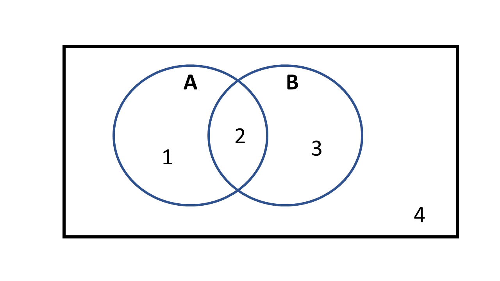

## All things Bayesian
```{=html}
<style type="text/css">

code.r{
  font-size: 30px;
}
</style>
```

-   <p style="color:orange">Bayesian Inference</p>

-   <p style="color:orange">Bayes Thereom</p>

-   <p style="color:orange">Bayesian Components</p>
    - likelihood, prior, evidence, posterior

-   <p style="color:orange">Bayesian Computation</p>
    - Conjugacy, Markov Chain Monte Carlo

## Probability, data, and Parameters

**What do we want our model to tell us?**

. . .

<p style="color:orange">Do we want to make probability statements about our data?</p>

. . .

**90\% CI**: the long-run proportion of corresponding CIs that will contain the true value 90\% of the time.

. . .


**Likelihood** = P(data|parameters)


## Probability, data, and Parameters

**What do we want our model to tell us?**

<p style="color:orange">Do we want to make probability statements about our parameters?</p>

. . .

**Alt. Interval**: 90\% probability that the true value lies within the interval, given the evidence from the observed data.

. . .

**Posterior** = P(parameters|data)

## Likelihood Inference

Estimate of the population size of hedgehogs at two sites.

```{r, eval=TRUE,echo=FALSE}
set.seed(923874)                 # Create example data
data <- data.frame(x = c("Site 1","Site 2"),
                         Pop.Size = c(75,100),
                         lower = c(40,80),
                         upper = c(90,120))

library("ggplot2")
ggplot(data, aes(x, Pop.Size)) +        # ggplot2 plot with confidence intervals
  geom_point(cex=4) +
  geom_errorbar(aes(ymin = lower, ymax = upper),size = 1)

```

## Bayesian Inference

```{r, eval=TRUE,echo=FALSE}
par(mfrow=c(1,2))
hist(rnorm(10000,75,20),xlim=c(0,200),freq=FALSE,main="Posterior Probability Distribution",xlab="Population Size at Site 1")
curve(dnorm(x,75,20),xlim=c(0,200),main="Posterior Probability Distribution",ylab="Density",lwd=3,xlab="Population Size at Site 1")
```

## Bayesian Inference

```{r, eval=TRUE,echo=FALSE}
par(mfrow=c(1,2))
set.seed(546543)
x=rnorm(10000,75,20)
hist(x,xlim=c(0,200),freq=FALSE,main="Posterior Probability Distribution",xlab="Population Size at Site 1")
abline(v=mean(x),lwd=3,col=2)

curve(dnorm(x,75,20),xlim=c(0,200),main="Posterior Probability Distribution",ylab="Density",lwd=3,xlab="Population Size at Site 1")
abline(v=mean(x),lwd=3,col=2)
```

## Bayesian Inference

```{r, eval=TRUE,echo=FALSE}
par(mfrow=c(1,2))
set.seed(4345)
post1=rnorm(10000,75,15)
post2=rnorm(10000,100,15)
hist(post1,freq=FALSE,xlim=c(20,150),main="Posterior Distributions \nof Adundance for Site 1 and Site 2 ",
     xlab="Population Size")
hist(post2,freq=FALSE,xlim=c(20,150),add=TRUE,col=2)
diff=post2-post1
hist(diff,freq=FALSE,col=3,main="Posterior Distributions \nof the difference in Adundance \nfor Site 1 and Site 2 ",
     xlab="Pop Size 2 - Pop Size 1")
```

```{r, eval=TRUE,echo=TRUE}
length(which(diff>0))/length(diff)
```

## Likelihood Inference (coeficient) {.scrollable}

```{r, eval=TRUE,echo=FALSE}
set.seed(5435)
x=seq(-1,1,by=0.1)
y=rnorm(21,mean=1+1*x,sd=1)
```

y is Body size of a beetle species

x is elevation

```{r, eval=TRUE,echo=TRUE}
summary(glm(y~x))
```

## Bayesian Inference (coeficient)

```{r, eval=TRUE,echo=FALSE}
set.seed(543534)
post=rnorm(1000,0.5,1)
hist(post,main="Posterior Distribution of Effect of Elevation",freq = FALSE,xlab="Slope/Coeficient")
abline(v=0, lwd=3,col=2)
abline(v=mean(post), lwd=3,col=3)
legend("topleft",col=c(2,3),lwd=3,legend=c("No Effect", "Posterior Mean"))
```

## Bayesian Inference (coeficient) {.scrollable}    

```{r, eval=TRUE,echo=TRUE}
#Posterior Mean
  mean(post)
```

<br>

. . .


```{r, eval=TRUE,echo=TRUE}
#Credible/Probability Intervals 
  quantile(post,prob=c(0.025,0.975))
```

<br>

. . .


```{r, eval=TRUE,echo=TRUE}
# #Probabilty of a postive effect
 length(which(post>0))/length(post)
```

<br>

. . .

```{r, eval=TRUE,echo=TRUE}
# #Probabilty of a negative effect
 length(which(post<0))/length(post)
``` 
 
## Bayes Theorem 

::: columns
::: {.column width="40%"}

-   <p style="color:purple">Marginal Probability</p>
    - $P(A)$
    - $P(B)$
:::
::: {.column width="60%"}

<span><center>Sampled N = 10 locations</center></span>

{fig-align="center" width="700"}

:::
:::

## Bayes Theorem 

::: columns
::: {.column width="40%"}

-   <p style="color:purple">Joint Probability</p>
    - $P(A \cap B)$
    - $P(A \cap \overline{B})$
    - $P(B \cap \overline{A})$
:::
::: {.column width="60%"}

<span><center>Sampled N = 10 locations</center></span>

{fig-align="center" width="700"}

:::
:::

## Bayes Theorem 

::: columns
::: {.column width="40%"}

-   <p style="color:purple">Conditional Probability</p>
    - $P(A|B)$ 
    - $P(B|A)$
    - $P(B|\overline{A})$
    - $P(A|\overline{B})$
:::
::: {.column width="60%"}

<span><center>Sampled N = 10 locations</center></span>

{fig-align="center" width="700"}

:::
:::


## Bayes Theorem 

::: columns
::: {.column width="40%"}

-   <p style="color:purple">OR Probability</p>
    - $P(A\cup B)$
:::
::: {.column width="60%"}

<span><center>Sampled N = 10 locations</center></span>

{fig-align="center" width="700"}

:::
:::


## Noctice that... {.scrollable}

$$
\begin{equation}
P(A|B)P(B) = P(A \cap B) \\
P(B|A)P(A) = P(A \cap B) \\
\end{equation}
$$

. . .

$$
\begin{equation}
P(B|A)P(A) = P(A|B)P(B)
\end{equation}
$$


. . .


### <span style="color:orange">Bayes Theoreom</span> 


$$
\begin{equation}
P(B|A) = \frac{P(A|B)P(B)}{P(A)} \\
\end{equation}
$$

. . .

$$
\begin{equation}
P(B|A) = \frac{P(A \cap B)}{P(A)} \\
\end{equation}
$$

## Bayes Components {.scrollable}

param = parameters
$$
\begin{equation}
P(\text{param}|\text{data}) = \frac{P(\text{data}|\text{param})P(\text{param})}{P(\text{data})} \\
\end{equation}
$$

. . .

<p style="color:orange">Posterior Probability/Belief</p> 

. . .

<p style="color:orange">Likelihood</p>

. . .

<p style="color:orange">Prior Probability</p> 

. . .

<p style="color:orange">Evidence or Marginal Likelihood</p> 


## Bayes Thereom {.scrollable}

param = parameters

$$
\begin{equation}
P(\text{param}|\text{data}) = \frac{P(\text{data}|\text{param})P(\text{param})}{\int_{\forall \text{ Param}} P(\text{data}|\text{param})P(\text{param})} 
\end{equation}
$$

<p style="color:orange">Posterior Probability/Belief</p> 

<p style="color:orange">Likelihood</p>

<p style="color:orange">Prior Probability</p> 

<p style="color:orange">Evidence or Marginal Likelihood</p> 

## Bayes Components {.scrollable}

$$
\begin{equation}
\text{Posterior} = \frac{\text{Likelihood} \times \text{Prior}}{\text{Evidence}} \\
\end{equation}
$$

. . .

$$
\begin{equation}
\text{Posterior} \propto \text{Likelihood} \times \text{Prior} \end{equation}
$$

. . .

$$
\begin{equation}
\text{Posterior} \propto \text{Likelihood} 
\end{equation}
$$


## Bayesian Model {.scrollable}

<p style="color:purple">Model</p> 
$$
\textbf{y} \sim \text{Bernoulli}(p)
$$

. . .

<p style="color:purple">Prior</p> 

$$
p \sim \text{Beta}( \alpha, \beta) \\
$$

These are called Prior hyperparameters

$$
\alpha = 1 \\
\beta = 1
$$
. . .

```{r eval=TRUE, echo=TRUE}
curve(dbeta(x,1,1),xlim=c(0,1),lwd=3,col=2,xlab="p",
      ylab = "Prior Probability Density")
```

<!-- sum(dbinom(y,size=1,p,log=TRUE)) -->
<!-- dbeta(p,1,1,log=TRUE) -->

## Conjugate Distribution {.scrollable}

<p style="color:purple">Likelihood (Joint Probability of y)</p> 

$$
\mathscr{L}(p|y) = \prod_{i=1}^{n} P(y_{i}|p)  = \prod_{i=1}^{N}(p^{y}(1-p)^{1-y_{i}})
$$

. . .

<p style="color:purple">Prior Distribution</p> 

$$
P(p) = \frac{p^{\alpha-1}(1-p)^{\beta-1}}{B(\alpha,\beta)}
$$

. . .

<p style="color:purple">Posterior Distribution of p</p> 

$$
P(p|y) = \frac{\prod_{i=1}^{N}(p^{y}(1-p)^{1-y_{i}}) \times \frac{p^{\alpha-1}(1-p)^{\beta-1}}{B(\alpha,\beta)} }{\int_{p}(\text{numerator})}
$$
. . .

<center><span style="color:purple">CONJUGACY!</span></center>

. . .

$$
P(p|y) \sim \text{Beta}(\alpha^*,\beta^*)
$$

. . .

$\alpha^*$ and $\beta^*$ are called Posterior hyperparameters

$$
\alpha^* = \alpha + \sum_{i=1}^{N}y_i \\
\beta^* = \beta + N - \sum_{i=1}^{N}y_i \\
$$

[Wikipedia Conjugate Page](https://en.wikipedia.org/wiki/Conjugate_prior)

[Conjugate Derivation](https://towardsdatascience.com/conjugate-prior-explained-75957dc80bfb)

## Hippos

We do a small study on hippo survival and get these data...

{fig-align="center" width="300"}

<span><center>7 Hippos Died </center></span>
<span><center>2 Hippos Lived</center></span>

## Hippos- Likelihood Model

$$
\begin{align*}
\textbf{y} \sim& \text{Binomial}(N,\boldsymbol{p})\\
\end{align*}
$$
. . .

```{r eval=TRUE, echo=TRUE}
# Survival outcomes of three adult hippos
  y1=c(0,0,0,0,0,0,0,1,1)
  N1=length(y1)
  mle.p=mean(y1)
  mle.p
```

## Hippos- Bayesian Model (Prior 1) {.scrollable}

$$
\begin{align*}
\textbf{y} \sim& \text{Binomial}(N,\boldsymbol{p})\\
p \sim& \text{Beta}(\alpha,\beta)
\end{align*}
$$

. . .

### Prior 1

```{r eval=TRUE, echo=TRUE}
  alpha1=1
  beta1=1
```

. . .

```{r eval=TRUE, echo=FALSE}
#Plot of prior 1
curve(dbeta(x,shape1=alpha1,shape2=beta1),lwd=3,
      xlab="Probability",ylab="Probabilty Density",
      main="Prior Probability of Success",ylim=c(0,20))
legend("topleft",col=c(1,2),legend=c("Prior 1"),lwd=3)
```


## Hippos- Bayesian Model (Prior 2) {.scrollable}

```{r eval=TRUE, echo=TRUE}
  alpha2=10
  beta2=2
```

. . .

```{r eval=TRUE, echo=FALSE}
curve(dbeta(x,shape1=alpha1,shape2=beta1),lwd=3,
      xlab="Probability",ylab="Probabilty Density",
      main="Prior Probability of Success",ylim=c(0,20))
legend("topleft",col=c(1,2),legend=c("Prior 1"),lwd=3)
curve(dbeta(x,shape1=alpha2,shape2=beta2),lwd=3,col=2,add=TRUE)
legend("topleft",col=c(1,2),legend=c("Prior 1", "Prior 2"),lwd=3)
```

## Hippos- Bayesian Model (Prior 3) {.scrollable}

```{r eval=TRUE, echo=TRUE}
  alpha3=150
  beta3=15
```

. . .

```{r eval=TRUE, echo=FALSE}
curve(dbeta(x,shape1=alpha1,shape2=beta1),lwd=3,
      xlab="Probability",ylab="Probabilty Density",
      main="Prior Probability of Success",ylim=c(0,20))
legend("topleft",col=c(1,2),legend=c("Prior 1"),lwd=3)
curve(dbeta(x,shape1=alpha2,shape2=beta2),lwd=3,col=2,add=TRUE)
curve(dbeta(x,shape1=alpha3,shape2=beta3),lwd=3,col=3,add=TRUE)
legend("topleft",col=c(1,2,3),legend=c("Prior 1", "Prior 2","Prior 3"),lwd=3)

```

## Hippos- Bayesian Model (Posteriors) {.scrollable}

$$
P(p|y) \sim \text{Beta}(\alpha^*,\beta^*)\\
\alpha^* = \alpha + \sum_{i=1}^{N}y_i \\
\beta^* = \beta + N - \sum_{i=1}^{N}y_i \\
$$
```{r eval=TRUE, echo=TRUE}
# Note- the data are the same, but the prior is changing
  post.1=rbeta(10000,alpha1+sum(y1),beta1+N1-sum(y1))
  post.2=rbeta(10000,alpha2+sum(y1),beta2+N1-sum(y1))
  post.3=rbeta(10000,alpha3+sum(y1),beta3+N1-sum(y1))
```

## Hippos- Bayesian Model (Posteriors)

```{r eval=TRUE, echo=FALSE}
plot(density(post.1),ylim=c(0,20),xlim=c(0,1),col=1,lwd=3,main="Prior 1",
     xlab="Posterior Probability",ylab="Probability Density")
curve(dbeta(x,shape1=alpha1,shape2=beta1),
      add=TRUE,col=1,lwd=3,lty=3)
abline(v=mle.p,col="purple",lwd=3)
legend("topright",lwd=3,lty=c(1,3,1),col=c("black","black","purple"),
       legend=c("Posterior","Prior","MLE"))
```

## Hippos- Bayesian Model (Posteriors)

```{r eval=TRUE, echo=FALSE}
plot(density(post.2),ylim=c(0,20),xlim=c(0,1),col=2,lwd=3,main="Prior 2",
     xlab="Posterior Probability",ylab="Probability Density")
curve(dbeta(x,shape1=alpha2,shape2=beta2),
      add=TRUE,col=2,lwd=3,lty=3)
abline(v=mle.p,col="purple",lwd=3)
legend("topright",lwd=3,lty=c(1,3,1),col=c("red","red","purple"),
       legend=c("Posterior","Prior","MLE"))
```

## Hippos- Bayesian Model (Posteriors)

```{r eval=TRUE, echo=FALSE}
plot(density(post.3),ylim=c(0,20),xlim=c(0,1),col=3,lwd=3,main="Prior 3",
     xlab="Posterior Probability",ylab="Probability Density")
curve(dbeta(x,shape1=alpha3,shape2=beta3),
      add=TRUE,col=3,lwd=3,lty=3)
abline(v=mle.p,col="purple",lwd=3)
legend("topleft",lwd=3,lty=c(1,3,1),col=c("green","green","purple"),
       legend=c("Posterior","Prior","MLE"))
```

## Hippos- More data! (Prior 1)

```{r eval=TRUE, echo=TRUE}
y2=c(0,1,1,0,1,1,1,1,1,1,1,1,1,1,1,1,1,1,0,
     1,1,1,1,1,1,1,1,1,1,1,1,1,1,1,1,1,1,0)
length(y2)
```

. . .

```{r eval=TRUE, echo=FALSE}
N2=length(y2)

mle.p=mean(y2)

post.4=rbeta(10000,alpha1+sum(y2),beta1+N2-sum(y2))
post.5=rbeta(10000,alpha2+sum(y2),beta2+N2-sum(y2))
post.6=rbeta(10000,alpha3+sum(y2),beta3+N2-sum(y2))

plot(density(post.4),ylim=c(0,20),xlim=c(0,1),col=1,lwd=3,main="Prior 1",
     xlab="Posterior Probability",ylab="Probability Density")
curve(dbeta(x,shape1=alpha1,shape2=beta1),
      add=TRUE,col=1,lwd=3,lty=3)
abline(v=mle.p,col="purple",lwd=3)
legend("topleft",lwd=3,lty=c(1,3,1),col=c("black","black","purple"),
       legend=c("Posterior","Prior","MLE"))
```

## Hippos- More data! (Prior 2)

```{r eval=TRUE, echo=FALSE}
plot(density(post.5),ylim=c(0,20),xlim=c(0,1),col=2,lwd=3,main="Prior 2",
     xlab="Posterior Probability",ylab="Probability Density")
curve(dbeta(x,shape1=alpha2,shape2=beta2),
      add=TRUE,col=2,lwd=3,lty=3)
abline(v=mle.p,col="purple",lwd=3)
legend("topleft",lwd=3,lty=c(1,3,1),col=c("red","red","purple"),
       legend=c("Posterior","Prior","MLE"))
```

## Hippos- More data! (Prior 3)

```{r eval=TRUE, echo=FALSE}
plot(density(post.6),ylim=c(0,20),xlim=c(0,1),col=3,lwd=3,main="Prior 3",
     xlab="Posterior Probability",ylab="Probability Density")
curve(dbeta(x,shape1=alpha3,shape2=beta3),
      add=TRUE,col=3,lwd=3,lty=3)
abline(v=mle.p,col="purple",lwd=3)
legend("topleft",lwd=3,lty=c(1,3,1),col=c("green","green","purple"),
       legend=c("Prior 1","Prior 2","Prior 3"))

```

## Hippos- Data/prior Comparison {.scollable}

```{r eval=TRUE, echo=FALSE}
par(mfrow=c(1,2))
plot(density(post.1),ylim=c(0,20),xlim=c(0,1),col=1,lwd=3,main="Small Data",
     xlab="Posterior Probability",ylab="Probability Density")
#curve(dbeta(x,shape1=alpha1,shape2=beta1),
#      add=TRUE,col=1,lwd=3,lty=3)
#abline(v=mle.p,col="purple",lwd=3)

lines(density(post.2),ylim=c(0,20),xlim=c(0,1),col=2,lwd=3)
#curve(dbeta(x,shape1=alpha2,shape2=beta2),
#      add=TRUE,col=2,lwd=3,lty=3)
#abline(v=mle.p,col="purple",lwd=3)

lines(density(post.3),ylim=c(0,20),xlim=c(0,1),col=3,lwd=3)
#curve(dbeta(x,shape1=alpha3,shape2=beta3),
#      add=TRUE,col=3,lwd=3,lty=3)
#abline(v=mle.p,col="purple",lwd=3)
legend("topleft",lwd=3,lty=c(1,1,1),col=c("black","red","green"),
       legend=c("Prior 1","Prior 2","Prior 3"))

#################
plot(density(post.4),ylim=c(0,20),xlim=c(0,1),col=1,lwd=3,main="More Data",
     xlab="Posterior Probability",ylab="Probability Density")
#curve(dbeta(x,shape1=alpha1,shape2=beta1),
#      add=TRUE,col=1,lwd=3,lty=3)
#abline(v=mle.p,col="purple",lwd=3)

lines(density(post.5),ylim=c(0,20),xlim=c(0,1),col=2,lwd=3)
#curve(dbeta(x,shape1=alpha2,shape2=beta2),
#      add=TRUE,col=2,lwd=3,lty=3)
#abline(v=mle.p,col="purple",lwd=3)

lines(density(post.6),ylim=c(0,20),xlim=c(0,1),col=3,lwd=3)
#curve(dbeta(x,shape1=alpha3,shape2=beta3),
#      add=TRUE,col=3,lwd=3,lty=3)
#abline(v=mle.p,col="purple",lwd=3)
legend("topleft",lwd=3,lty=c(1,1,1),col=c("black","red","green"),
       legend=c("Prior 1","Prior 2","Prior 3"))

```

## Markov Chain Monte Carlo {.scollable}

Often don't have conjugate likelihood and priors, so we use MCMC algorithims to sample posteriors.

Options

-   Write your own algorithim
-   BUGS, JAGS, Stan, Nimble

## MCMC Sampling 

-   number of sample (iterations)
-   thinning (which iterations to keep), every one (1), ever other one (2), every third one (3)
-   burn-in (how many of the first samples to remove)
-   chains (uniqe sets of samples; needed for convergence tests)
