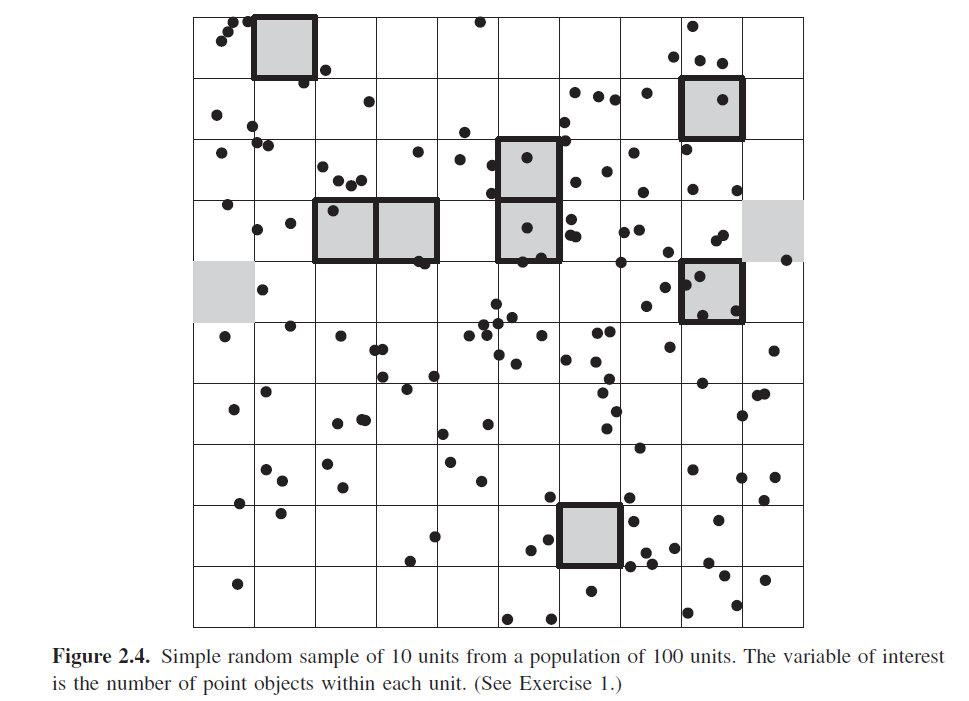

    

```{r setup, include=FALSE}
knitr::opts_chunk$set(echo = TRUE)
```

## Chapter 2, Problem 1

<style type="text/css">
  body{
  font-size: 14pt;
}
pre.r { /* Targets R code blocks */
      font-size: 12pt;
    }
code { /* Targets inline code */
      font-size: 12pt;
    }

</style>


{width=80%}


*In Figure 2.4, the locations of objects (e.g., trees, mines, dwellings) in a study region are given  by the centers of “+” symbols. The goal is to estimate the number of objects in the study region.*

### Part a

*(a) A random sample without replacement of n = 10 units has been selected from the N = 100 units in the population. Units selected are indicated by shading in Figure 2.4. List the sample data. Use the sample to estimate the number of objects in the figure. Estimate the variance of your estimator.*


#### List the sample data

If the point crossed the thick black line into the cell, I considered it a sample

```{r}
y <- c(0, 1, 1, 1, 1, 3, 1, 0, 4, 0)
```

#### Estimate the number of objects in the figure

```{r}
# Total number of cells
  N <- 100

# The estimate of the number of objects in the figure.
  N*mean(y)

# Sample Size
  n <- 10

# Variance of the estimator
  ((N-n)/N)*(var(y)/n)
```

### Part b

*(b) Repeat part (a), selecting another sample of size 10 by simple random sampling (without  replacement) and making new estimates. Indicate the
positions of the units of the samples on the sketch.* 

#### Select new Sample and make Estimates

```{r}

# locations of new sample
  newsample <- sample(1:100,10, replace = FALSE)

# new sample
  y <- c(1, 0, 1, 1, 3, 1, 1, 0, 2, 2)

# The estimate of the number of objects in the figure.
  N*mean(y)

# Variance of the estimator
 ((N-n)/N)*(var(y)/n)
  

```

### Part c

Give the inclusion probability for the unit in the upper left-hand corner. How many possiblesamples are there? What is the probability of selecting
the sample you obtained in part (a)? 


```{r}
# Inclusion probability for a given cell for n = 1 
1/N

# The inclusion probability for a given cell for n =10
n/N


# the probability of selecting the sample obtained in a
1/choose(100,10)
```

## Chapter 2, Problem 3

Consider a small population of N = 5 units, labeled 1, 2, 3, 4, 5, with respective y-values 3, 1, 0, 1, 5. Consider a simple random sampling design with a sample size n = 3. For your convenience, several parts of the following may be combined into a single table.

### Part a

Give the values of the population parameters $\mu$, $\tau$ , and $\sigma^2$. List every possible sample of size n = 3. For each sample, what is the probability that it is the one selected?


#### Population parameters

```{r}
y = c(3, 1, 0, 1, 5)

N = length(y)

mu = mean(y)
mu

tau = N*mu
tau

sigma2 = var(y)
sigma2

```

#### All possible samples of n = 3

```{r}
# Combinations
  all.possible.3=utils::combn(y, 3)
 all.possible.3
# probability of a given sample
  1/choose(N,3)

```

### Part b

For each sample, compute the sample mean y and the sample median m. Demonstrate that the sample mean is unbiased for the population mean
and determine whether the sample median is unbiased for the population median.

```{r}
sample.means = apply(all.possible.3,2,mean)
sample.medians = apply(all.possible.3,2,median)

# Unbiasedness of sample mean - Yes
  mean(sample.means)-mu

# Unbiasedness of sample median - No
  mean(sample.medians)-mu

```